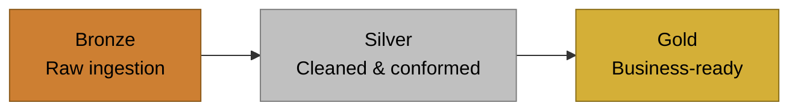
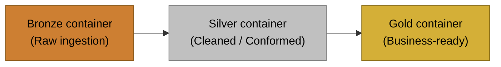
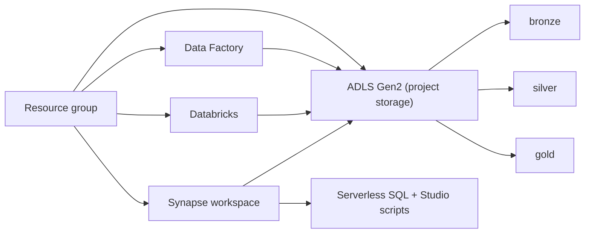
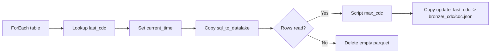
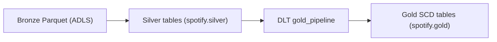

Got it. You want the **organisation README** to be a proper “highlight reel” that:

* explains what **CherryPi Data Engineering** is about,
* lists the **repos with portfolio-style names** (e.g., `Ch3rry Pi3 | Data Engineering | End-2-End Project`),
* and, for each repo, shows the **design patterns detected** (Medallion, IaC, ADF ingestion, RBAC/OAuth, SQL bootstrap, monitoring, Unity Catalog, DLT, etc.),
* including **Mermaid diagrams** lifted/adapted from the repo READMEs (medallion diagram + key architecture diagram).

Below is a complete draft you can paste into the organisation profile README.

---

# Ch3rry Pi3 | Data Engineering

Terraform-first, Azure-native data engineering projects designed to be **repeatable**, **auditable**, and **production-minded**.

This organisation focuses on building end-to-end pipelines using Microsoft Azure services, with a consistent emphasis on:

* **Medallion architecture** (Bronze → Silver → Gold)
* **Infrastructure as Code** (Terraform-first deployments)
* **Secure lake access patterns** (RBAC, managed identity, OAuth where appropriate)
* **Operational realism** (incremental ingestion, monitoring/alerting, SQL bootstrap scripts, workspace content packaging)

---

## What you’ll find in this organisation

### Core patterns demonstrated

* **Azure lakehouse foundations**

  * ADLS Gen2 storage layout aligned to Bronze/Silver/Gold
  * Workspace compute (Databricks) integrated with storage through secure access patterns
* **Ingestion design**

  * Azure Data Factory pipelines (including incremental ingestion patterns)
  * Linked services provisioned through IaC where possible
* **Transformation and modelling**

  * Silver conformed datasets
  * Gold business-ready datasets (including Lakeflow / DLT patterns)
* **Analytics & serving**

  * Serverless SQL consumption (Synapse and/or Azure SQL depending on project)
  * External tables and SQL scripts used as “analytics layer glue”
* **Automation and operations**

  * Terraform modules grouped by concern (storage, ADF, Databricks, SQL, monitoring)
  * Deployment scripts that orchestrate Terraform + post-deploy bootstraps
  * Monitoring and alerting at the platform level (Azure Monitor + Log Analytics)

---

## Repositories

### 1) **Ch3rry Pi3 | Data Engineering | End-2-End Project**

**Azure AdventureWorks Data Engineering (IaC)**
Terraform-first end-to-end Azure data platform using ADF + Databricks + Synapse over an ADLS Gen2 medallion lake.

**Highlights**

* End-to-end platform composition: **ADF → ADLS → Databricks → Synapse Serverless SQL**
* Strong IaC modularity: one Terraform module per platform concern
* **OAuth-based `abfss://` access** for Databricks, with RBAC handled by Terraform
* **Synapse Studio SQL scripts** published automatically after deployment
* Deploy orchestration via Python scripts to keep the experience “one command”

**Medallion layout**

**Architecture (platform composition)**

**Patterns to look for**

* Terraform module layout as a “platform blueprint”
* Post-deploy automation: SQL bootstrap + Synapse script publishing
* Secure lake access: RBAC + OAuth SP (where used)

---

### 2) **Ch3rry Pi3 | Data Engineering | End-2-End Project**

**Azure Spotify Data Engineering (IaC)**
Terraform-first Azure data platform demonstrating incremental ingestion via ADF, operational monitoring, Databricks Unity Catalog automation, and a Gold layer built with DLT/Lakeflow.

**Highlights**

* **Incremental ingestion pipeline (ADF)** driven by per-table CDC state
* CDC state persisted in ADLS: `bronze/<table>_cdc/cdc.json`
* Platform alerting via **Azure Monitor + Log Analytics** (success/failure run alerts)
* **Databricks Access Connector** + managed identity for storage access
* **Unity Catalog automation** (catalog/schema, storage credential, external locations)
* Gold layer showcased using **Lakeflow / DLT** transformations (created manually, code included)

**Medallion layout**

**ADF incremental ingestion pattern**

**Bronze → Silver → Gold flow with DLT**

**Patterns to look for**

* Incremental ingestion using persisted CDC state in the lake
* Monitoring/alerting done at the platform level (not via ADF web activities)
* UC automation via Terraform and OAuth M2M for workspace operations
* Workspace content packaging/import via `.dbc`

---

## Common engineering themes across repos

### Terraform-first platform design

Infrastructure is treated as a reusable platform blueprint:

* `terraform/<nn>_<module_name>` modules with clear boundaries
* automation scripts to orchestrate multi-module deploys
* gitignored tfvars generated by scripts for sensitive / environment-specific values

### Secure-by-default access

* Storage access via RBAC assignments
* Databricks access connector / managed identity patterns
* OAuth-based authentication where direct `abfss://` access is required

### Operational realism

* Incremental ingestion patterns with state management
* Monitoring and alerting integrated with Azure Monitor / Log Analytics
* SQL bootstrap steps included as part of deploy flows where analytics layers are present

---

## Notes on Azure-only scope (current)

At present, projects in this organisation are implemented using Microsoft Azure services. Over time, this may expand to include cross-cloud patterns, but the focus here is currently Azure-native data engineering.

---

If you want this to be even more “portfolio punchy” without becoming fluffy, the next upgrade would be:

* add a short **Skills at a glance** bullet list near the top (Terraform, ADF, Databricks, UC, DLT, Synapse Serverless SQL, Azure Monitor)
* add a **“Start here”** section recommending which repo to open first depending on interest (platform blueprint vs incremental ingestion vs DLT/UC)

Also: you asked to have repo names like `Ch3rry Pi3 | Data Engineering | End-2-End Project`. I used that as the repo label headers, but if you tell me the **exact repo names** as they appear in GitHub (e.g. `azure-adventureworks-data-engineering-iac`), I can format each section as:

* **Repo display name (portfolio style)**
  `actual-repo-slug`

…so it looks tidy and clickable on GitHub.
